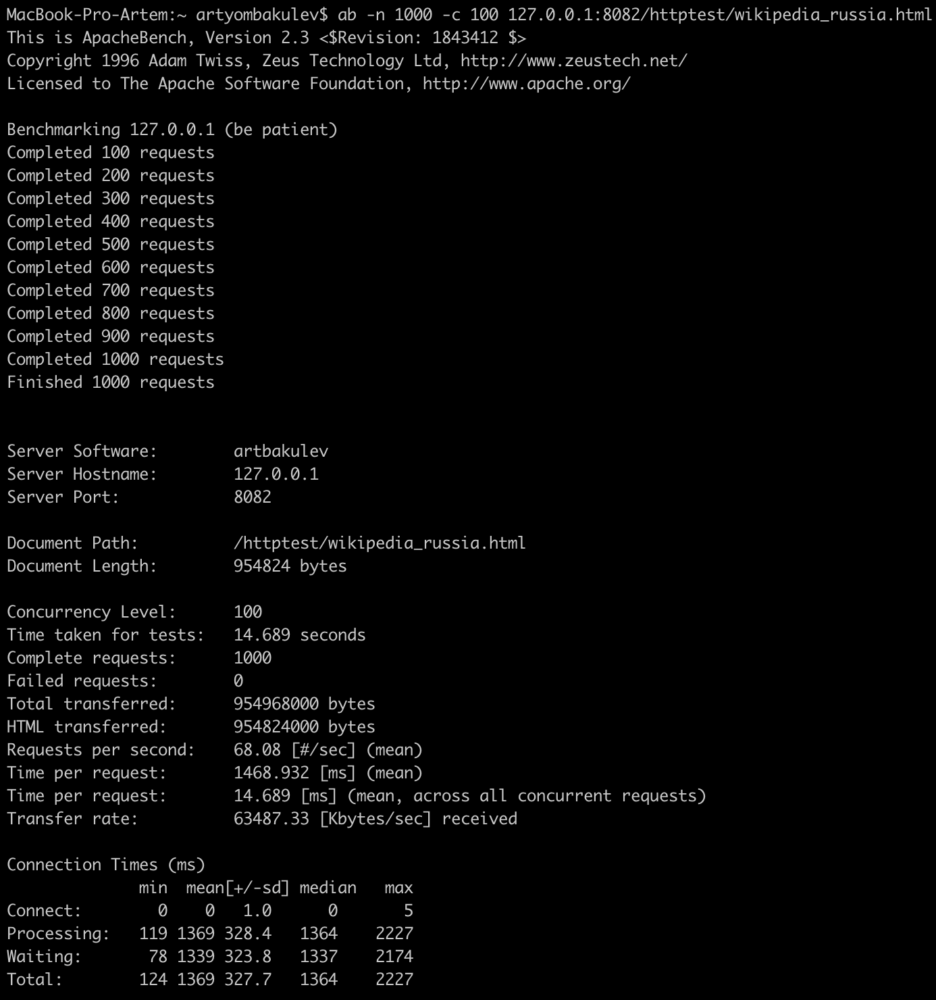
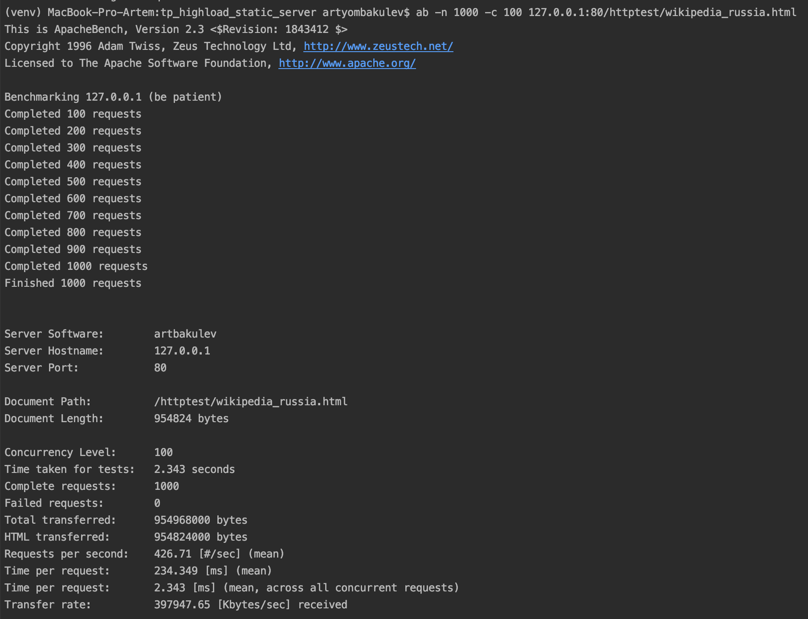
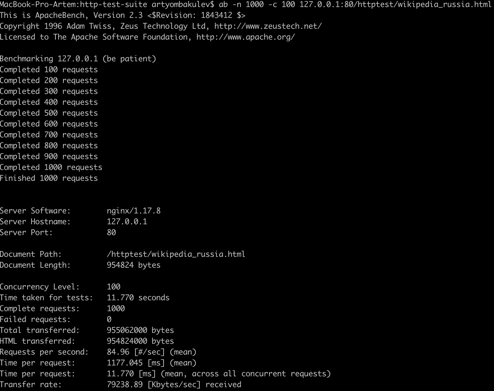

### Highload python static server based on asyncio

#### Запуск через докер:

```
docker build -t artbakulev .
docker run -p 80:80 -v httpd.conf:/etc/httpd.conf:ro -v /{absolute_path_to_project}/tp_highload_static_server/http-test-suite:/var/www/html:ro tp-highload-hw1:latest
```

#### Прогон тестов:
```
cd http-test-suite
python2 httptest.py
```
 
 ### Нагрузка через ab:
 
 ```
 ab -n 100000 -c 100 localhost/httptest/wikipedia_russia.html
 ```
 
 ### Запуск nginx:
 
 ```
docker run -it -v /{absolute_path_to_project}/tp_highload_static_server/http-test-suite:/usr/share/nginx/html:ro -p 80:80 nginx
 ```
 
 #### My server RPS:
 внутри докера, без многопоточности

   
 без докера, с многопоточностью


 
 #### Nginx RPS:
 внутри докера
 
 
 
 